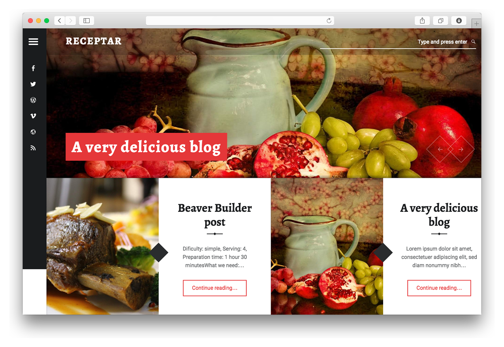

# Receptar Theme for Grav



Receptar is simple, modern, responsive, high-DPI, fully customizable, stylish blog Grav theme by [WebMan Design](http://themedemos.webmandesign.eu/).
It features split-screen book-like design inspired by a modern cook book with emphasize on beautiful imagery and typography.

# Features

* Navigation menu included
* Split-screen book-like design
* Collapsible sidebar
* Blog Layout with support for Recipes
* Beautiful imagery and typography.
* Social Sharing
* Browser Compatibility
* Supports YouTube
* Supports SoundCloud
* Supports Vimeo
* SimpleSearch support
* Feeds
* RelatedPosts plugin support
* Archives plugin support
* JSComments plugin support
* Comments and Forms plugin support
* Basic translations for 14 languages

# Installation

Installing the Receptar theme can be done in one of two ways. Our GPM (Grav Package Manager) installation method enables you to quickly and easily install the theme with a simple terminal command, while the manual method enables you to do so via a zip file.

The theme by itself is useful, but you may have an easier time getting up and running by installing a skeleton. The [Receptar Site Skeleton](https://github.com/getgrav/grav-skeleton-receptar-blog) is a self-contained repository for a complete sites which includes: sample content, configuration, theme, and plugins.

## GPM Installation (Preferred)

The simplest way to install this theme is via the [Grav Package Manager (GPM)](http://learn.getgrav.org/advanced/grav-gpm) through your system's Terminal (also called the command line).  From the root of your Grav install type:

    bin/gpm install receptar

This will install the Receptar theme into your `/user/themes` directory within Grav. Its files can be found under `/your/site/grav/user/themes/receptar`.

## Manual Installation

To install this theme, just download the zip version of this repository and unzip it under `/your/site/grav/user/themes`. Then, rename the folder to `receptar`. You can find these files either on [GitHub](https://github.com/getgrav/grav-theme-receptar) or via [GetGrav.org](http://getgrav.org/downloads/themes).

You should now have all the theme files under

    /your/site/grav/user/themes/receptar

>> NOTE: This theme is a modular component for Grav which requires the [Grav](http://github.com/getgrav/grav), [Error](https://github.com/getgrav/grav-theme-error) and [Problems](https://github.com/getgrav/grav-plugin-problems) plugins.

# Updating

As development for the Receptar theme continues, new versions may become available that add additional features and functionality, improve compatibility with newer Grav releases, and generally provide a better user experience. Updating Receptar is easy, and can be done through Grav's GPM system, as well as manually.

## GPM Update (Preferred)

The simplest way to update this theme is via the [Grav Package Manager (GPM)](http://learn.getgrav.org/advanced/grav-gpm). You can do this with this by navigating to the root directory of your Grav install using your system's Terminal (also called command line) and typing the following:

    bin/gpm update receptar

This command will check your Grav install to see if your Receptar theme is due for an update. If a newer release is found, you will be asked whether or not you wish to update. To continue, type `y` and hit enter. The theme will automatically update and clear Grav's cache.

## Manual Update

Manually updating Receptar is pretty simple. Here is what you will need to do to get this done:

* Delete the `your/site/user/themes/receptar` directory.
* Download the new version of the Receptar theme from either [GitHub](https://github.com/getgrav/grav-theme-receptar) or [GetGrav.org](http://getgrav.org/downloads/themes).
* Unzip the zip file in `your/site/user/themes` and rename the resulting folder to `receptar`.
* Clear the Grav cache. The simplest way to do this is by going to the root Grav directory in terminal and typing `bin/grav clear-cache`.

> Note: Any changes you have made to any of the files listed under this directory will also be removed and replaced by the new set. Any files located elsewhere (for example a YAML settings file placed in `user/config/themes`) will remain intact.

# Setup

If you want to set Receptar as the default theme, you can do so by following these steps:

* Navigate to `/your/site/grav/user/config`.
* Open the **system.yaml** file.
* Change the `theme:` setting to `theme: receptar`.
* Save your changes.
* Clear the Grav cache. The simplest way to do this is by going to the root Grav directory in Terminal and typing `bin/grav clear-cache`.

Once this is done, you should be able to see the new theme on the frontend. Keep in mind any customizations made to the previous theme will not be reflected as all of the theme and templating information is now being pulled from the **receptar** folder.

## Configuration

In Receptar, you have few unique features which you can configure easily:

### Translations

Take a look at theme's **language.yaml**. Polish and English versions contains all variables which you can translate to your language.

### Adding recipes to blog page

In item.md page header you have to add something like that:

```yaml
ingredients_title: Ingredients
ingredients:
  - title: Corpus:
    list:
      - Lorem ipsum, 200g
      - Dolor sit amet 20dl
      - 80g sugar
      - 1 yolk
      - Salt
      - Water 0.5l
      - Milk 1l
  - title: Corpus:
    list:
      - Lorem ipsum, 200g
      - Dolor sit amet 20dl
      - 80g sugar
      - 1 yolk
      - Salt
      - Water 0.5l
      - Milk 1l
```

### Adding advanced description

Add code like that to page header:

```yaml
description:
  - option: Dificulty:
    value: simple
  - option: Serving:
    value: 4
  - option: Preparation time:
    value: 1 hour 30 minutes
  - option: What we need:
    value: oven, tart form, jar
```

### Adding video and SoundCloud

You have to add direct iframe url to page header. For example for Vimeo files, it's going to be:

```yaml
vimeo: https://player.vimeo.com/video/63451562?title=0&amp;byline=0&amp;portrait=0
```

### Slideshow

Add or modify this code in site.yaml:

```yaml
slider:
  - image: slide3.jpg
    title: A very delicious blog
    url: "#"
  - image: slide1.jpg
    title: Duis autem
    url: "#"
  - image: slide2.jpg
    title: Pumpkin recipe
    url: "#"
```

Slideshow images must be placed inside user theme **images/slideshow** directory.

### Featured image

To customize featured image, add or modify following variable in site.yaml:

```yaml
global_featured_image: featured.jpg
```

Featured images must be placed inside user theme **images** directory. Featured images is used on empty blog image posts and on posts without image (due to split-screen layout concept).
